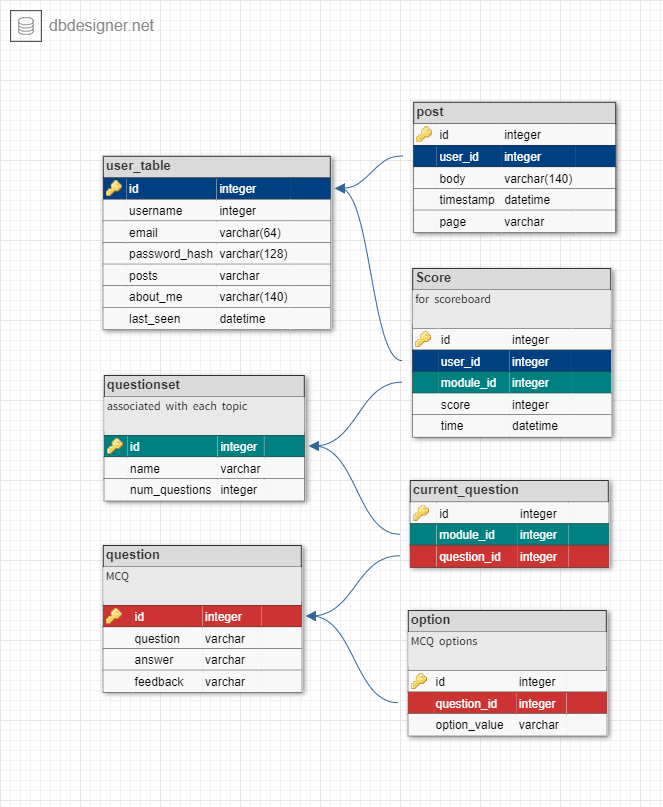

# Solar System

The website is part of CITS5505 Agile Web Development project 2 developed by
- Jason Clark (22601257)
- Doungporn Wiwatanapataphee (22774232)

## Purpose

The website provides a basic knowledge of the Solar System including the vacuum of space, the planets, the satellites, and the sun. At the end of each lesson, users are able to test their knowledge by taking a quiz.

## Features

1. User registration, login feature and password resetting.
2. Four learning modules including:
    - The Vacuum of Space
    - The Planets
    - The Satellites
    - The Sun
3. User's comment associated with each topic
4. Multiple choice quiz associated with each topic
    - Countdown timer
    - Viewing scores in real time
    - Answer validation
    - Answer submission
5. Topics' leaderboard
6. User profile
    - Timestamp of last visit
    - Editting username and/or about me
    - Aggregated scores from all topics
    - Individual user scoreboard
    - User performance of each topic
    - Delete comments
7. Aggregate Scoreboard

## Data Model




This database diagram was generated using Online Database Schema Design and Modeling Tool available at https://www.dbdesigner.net/.

## Getting Started

Firstly, make sure that Python 3 is installed on your local machine.

1. Clone the repository to local and change the working directory to solar-system:
```
git clone https://github.com/zamnolence/solar-system.git
cd solar-system
```

2. On the local repository, create a virtual environment:
```
python -m venv venv
```

3. Activating the virtual environment:
```
source venv/bin/activate
```

4. Install all required packages and plugins from requirements.txt:
```
pip install -r requirements.txt
```

5. Run the web application:
```
flask run
```


## Testing

1. Navigate to the tests folder and activate the virtual environment
```
cd /tests
source venv/bin/activate
```
2. In the terminal, start the server:
```
flask run
```
3. Open a separate terminal and load the same virtual environment.
- To run a specific group of tests, type:
```
python <testName.py>
```
For example:
```
python databaseTest.py
```
- To run the entire suite of tests, type:
```
python testSuite.py
```

Please note that two tests are half implemented, in the "quizTest.py" file.
Before this most recent commit, the first test "test_quiz_navigation" was
working fine, is now registerring the button required as obscured.
The test "test_quiz_selection" was never fully implemented, as it presented 
issues of a similar, but unrelated nature.
Due to time constraints, we have opted to leave it out of the testSuite, which 
otherwise works as expected.

## References